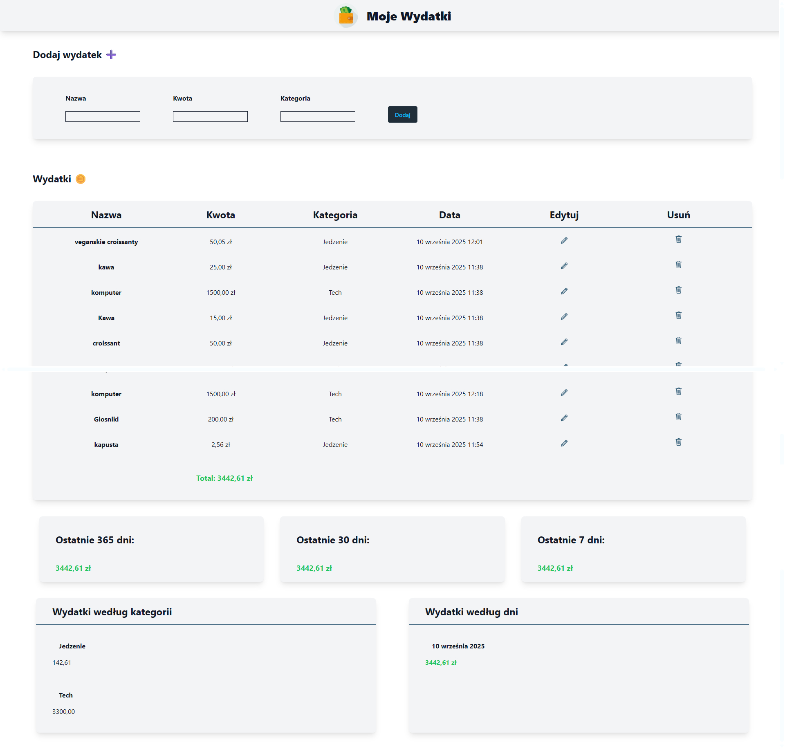

# expense_app_django_zaliczenie
Projekt na zaliczenie. Lokalna webowa aplikacja do zapisywania wydatków.

## Opis funkcji:

- dodawanie wydatków,
- sumy dzienne, miesięczne, roczne,
- grupowanie po kategoriach,
- prosty interfejs webowy z formularzem i tabelą.

## Instalacja
Zainstaluj zależności
`pip install -r requirements.txt`

Utwórz i włącz wirtualne środowisko
`python -m venv .venv`

Zainicjalizuj bazę
`python manage.py makemigrations`
`python manage.py migrate`

Uruchom aplikację
`python manage.py runserver`

Aplikacja będzie dostepna localhost:8000

